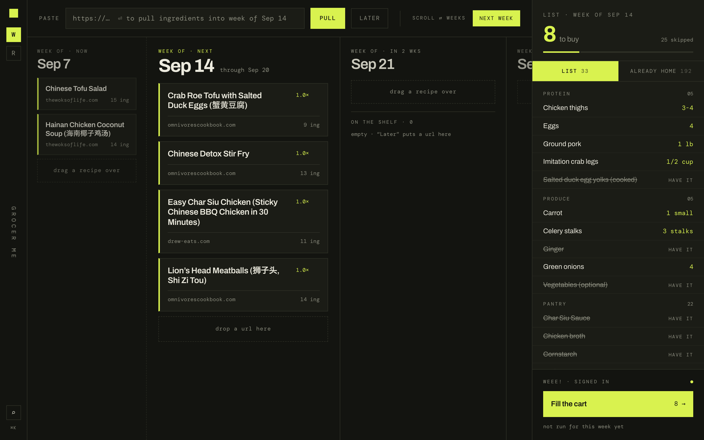
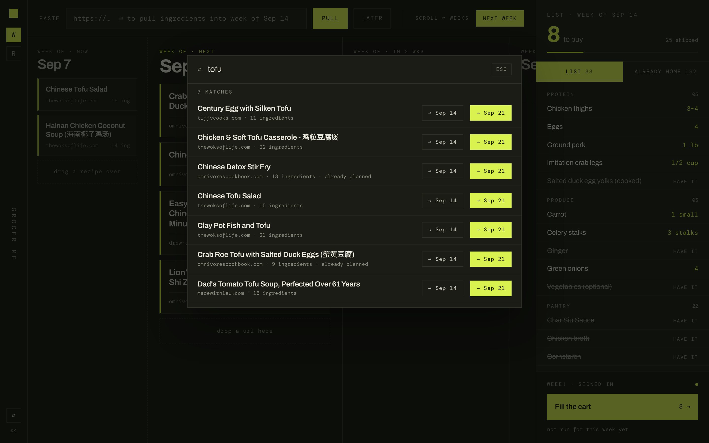
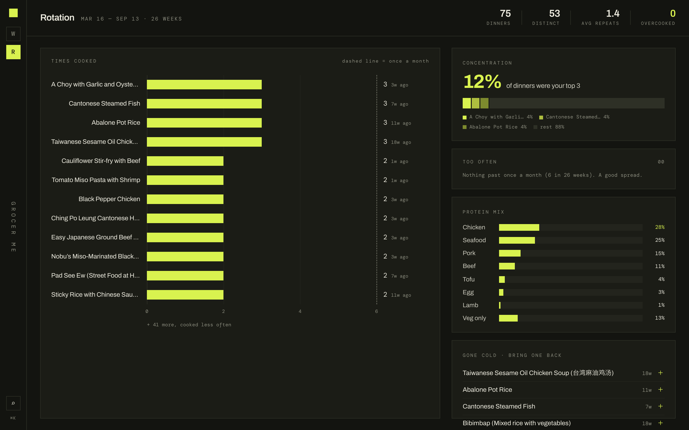

# grocer me

Paste the recipes you want to cook next week. Get back one shopping list — deduplicated, quantities summed, sorted by aisle, and then let it fill the cart for you.

The tedious part of cooking from recipes is never the cooking, it's figuring out if you 
have all the ingredients, in the correct quantities across 6 different tabs.



## How it works

```
recipe URLs  →  parse  →  merge  →  grocery list  →  store adapter  →  filled cart
```

**Parse** (`api/services/recipe_parser.py`) fetches each page and pulls out the
ingredient lines, splitting `"1 ½ cups (packed) brown sugar"` into a quantity, a
unit and a name. Unicode fractions, `of`-phrases and unit-less lines
(`"2 eggs"`) all fall out of the same two patterns, with the raw string kept
alongside so nothing is silently lost.

**Merge** (`api/services/ingredient_merger.py`) is the part worth a language
model. Recipe A wants "3 cloves garlic", recipe B wants "1 tbsp minced garlic",
recipe C wants "garlic powder" — and only two of those are the same shopping
item. Claude does the merge, sums the quantities, assigns each item to an aisle
category, and records which recipes each item came from, so removing a recipe
later can subtract exactly its share.

**Fill** (`api/services/stores/`) drives a real browser to put the list in a
cart. See below.

Around that: a week board with four weeks side by side, where recipes drag from
one week to another; a pantry ("already home") that gets subtracted from the
list; a shelf for recipes to try later; ⌘K search over everything you've
cooked; and a cook mode that keeps one recipe on screen at a time.



**Rotation** (`api/services/rotation.py`) looks back over the last 26 weeks of
plans: how many dinners, how many distinct recipes, which ones come round more
than once a month, the protein mix, and which old favourites have gone cold and
could come back. A recipe on a week's plan counts as a dinner; the app never
learns what actually got cooked, so the plan is the record.



## Store adapters

The app knows how to turn recipes into a list. It does not know anything about
any particular retailer, that all lives behind one interface:

```python
class StoreAdapter(Protocol):
    name: str
    label: str
    cart_url: str
    def check_login_status(self) -> dict: ...
    def open_login_page(self) -> dict: ...
    def add_items_to_cart(self, items: list[dict]) -> dict: ...
```

One adapter ships, for [Weee!](https://www.weee.com) (`stores/weee.py`).
There's no public API, so it drives Playwright: you log in by hand once, the
session is saved as browser storage state, and later runs reuse the cookies.
The fiddliest part is that the add-to-cart button is `width: 0` until its
product card is hovered, so the adapter hovers the card's container before
clicking.

Knowing whether you're still signed in takes asking the site: the header is
identical signed in or out, and a signed-out visitor is handed an auth cookie
too. So the adapter opens the account page and watches for a bounce to the
login form, and a cart run stops there rather than filling a signed-out cart.

Adding another store means adding a file to `stores/` and registering it — no
changes anywhere else. Pick one with `GROCER_STORE`.

**Scope.** This is built to drive *your own* account, for your own groceries.
It runs a visible browser at human pace and stops at the cart. The application will never place an order. Please don't point it at anyone else's account.

## Running it

Needs Python 3.9+ and Node 18+.

```bash
git clone https://github.com/nicolenish/grocer-me && cd grocer-me
cp .env.example .env          # add your Anthropic API key
python3 -m venv venv && source venv/bin/activate
pip install -r backend/requirements.txt
python -m playwright install chromium
(cd backend && python manage.py migrate)
(cd frontend && npm install)
./run.sh                      # backend :8000, frontend :5173
```

Then, once, to hand the store adapter a session — the **Sign in to Weee!**
button in the app does the same thing:

```bash
curl -X POST http://localhost:8000/api/weee/login/
```

That opens a browser on the sign-in page. Log in there; the session saves
itself to a gitignored directory as soon as the site says you're through.

## Stack

Django 4.2 + DRF, React 18 + Vite + TypeScript, SQLite, Playwright, and the
Anthropic API for the merge step.

```
backend/api/services/     parse, merge, rotation, and the store adapters
backend/api/models.py     SavedRecipe, WeeklyPlan, WeeklyGroceryItem,
                          PantryItem, WatchlistUrl, CartRun
frontend/src/components/  WeekBoard, ListRail, CartPanel, Rotation,
                          SearchOverlay, CookMode, Spine
```

## Notes

Written for one household, so a few things are deliberately simple: SQLite, no
accounts, no auth, `DEBUG = True`, and a browser that runs headed so you can
watch what it does. It is not deployed anywhere and is not trying to be.

MIT licensed.
